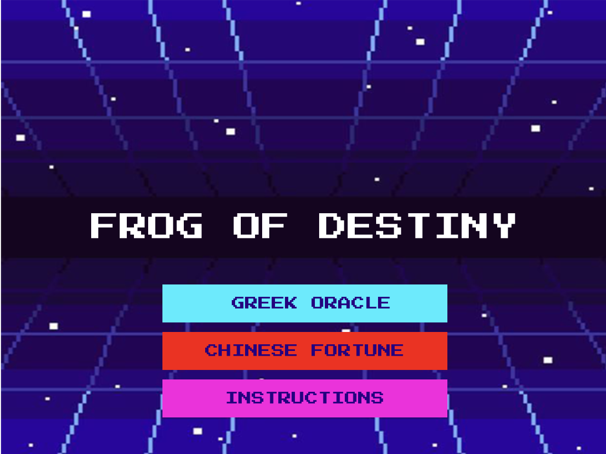
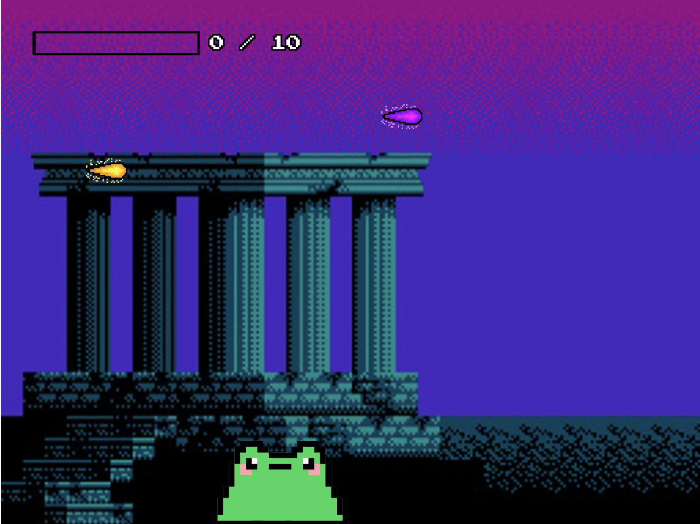

# FROG OF DESTINY

CAMELIA PITSILIS

[View this project online](URL_FOR_THE_RUNNING_PROJECT)

## Description

Frog of Destiny is a myth-inspired, frog tongue catching game where the player controls a
mystical frog that seeks either wisdom or fortune.

 There are two modes: Greek Oracle and Chinese Fortune.

 In Ancient Greek mythology, frogs were often associated with prophecy. So in the game Greek Oracle Frog Game,
 there will be two types of flying prophetical orbs: Golden Truthful Prophecies and Purple False Prophecies.
 The Frog will have to eat the Golden Truthful Prophecies to gain as many Wisdom Points before the time ends.
 If the Frog eats the Purple False Prophecies, the frog dies.
 
 In Chinese Mythology, Chan Chu (蟾蜍) is the Three-Legged Mythical Frog that brings fortune.
 So in the Chinese Fortune Frog Game, the frog will have to catch as many Golden Coins as possible
 before the time runs out. However, if the frog catches the Golden Coins too quickly, he will lose
 Fortune Points because of greed.
 
 Instructions:
 - Move the frog with your mouse
 - Click to launch the tongue
 - Catch object

MY CONTRIBUTIONS TO THE CODE:
 - Added different game states: start, oracle, fortune, instructions, end.
 - Added title screen with clickable buttons to select game mode.
 - Added an instructions screen.
 - Added two game modes:
    - Oracle Mode: Catch golden orbs, avoid purple orbs; scoring with wisdomPoints.
    - Fortune Mode: Catch coins; greed penalty decreases fortunePoints if catching too fast.
 - Added ending screens with different messages per mode.
 - Added scoring bars with dynamic filling based on points.
 - Added multiple flying objects per mode with varying speeds and reset positions.
 - Replaced frog ellipse with frog image.
 - Added custom font and visual design for UI.
 - Added dynamic messages (greed penalty, end message).
 

## Screenshot(s)

> 
> 
> 

## Attribution

> - This project uses [p5.js](https://p5js.org).

> - The background of the start screen was made by user3679043 from freepick.com: https://www.freepik.com/premium-vector/
abstract-retro-pixel-art-80s-background-eps-10-vector-graphics_18568568.htm?epik=dj0yJnU9cklDOTBFUEtrbEdmNDZ6Q3lLWHl6XzZVYzRGWVdRdmcmcD0wJm49cTlVOG5fZnZBSVRoVUsyd3ZEcloxZyZ0PUFBQUFBR2tNSEVZ

> - The background of the greek oracle mode was taken from tumblr: https://24.media.tumblr.com/tumblr_md0g8pEBPX1qbzzgco1_500.png

> - The background of the chinese fortune mode was taken from pinterest: https://uk.pinterest.com/pin/758152918542245462/

> - The coins in the chinese fortune mode was downloaded from nicepng.com :https://www.nicepng.com/ourpic/u2w7a9e6r5r5i1y3_8-bit-mario-coin-mario-coin-pixel/

> - The golden & purple prophecies from the greek oracle mode was made by the handsomeunicorn from thehandsomeunicorn.itch.io :https://handsomeunicorn.itch.io/fireball-sprite

> - A lot of the code was taken or inspired by Pippin Barr from https://pippinbarr.com/cart253