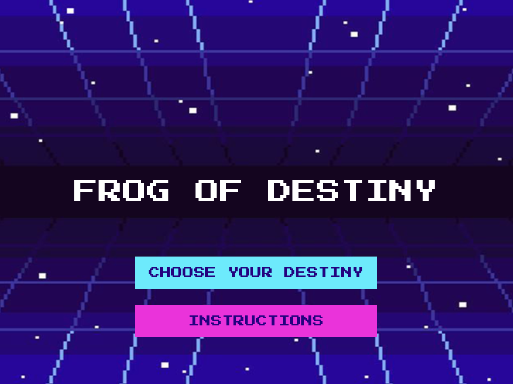
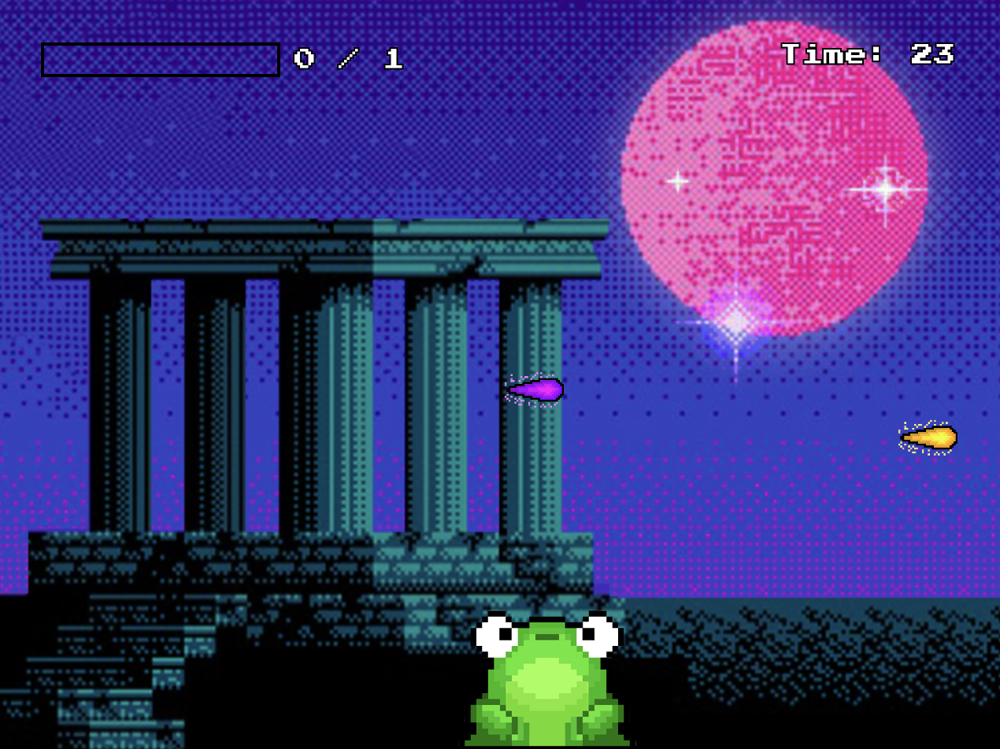
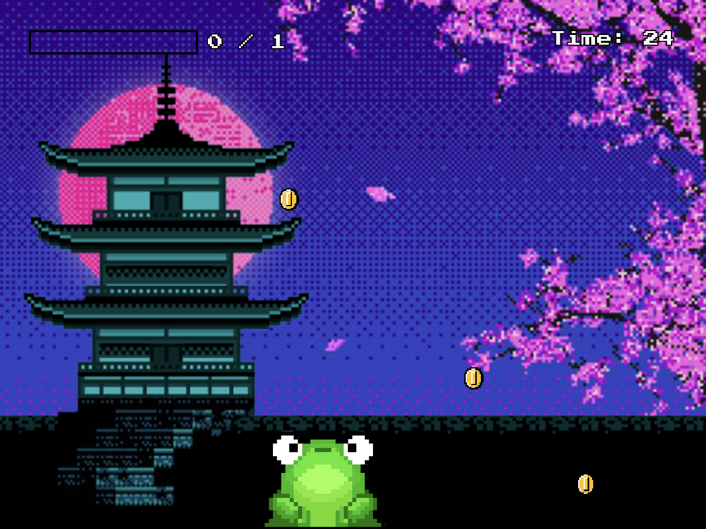
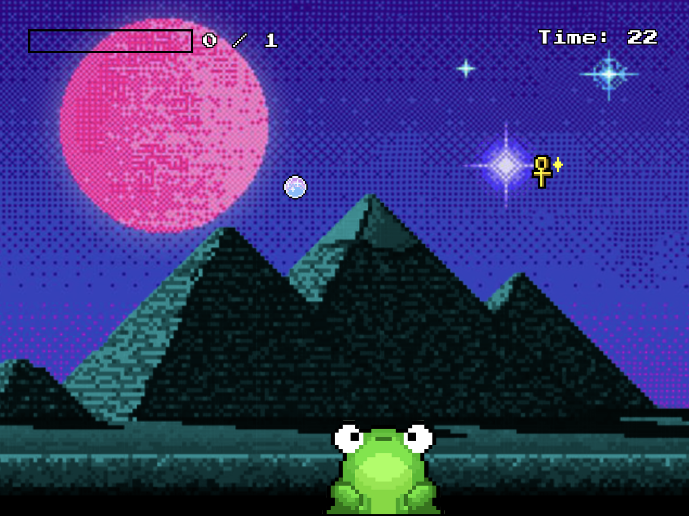
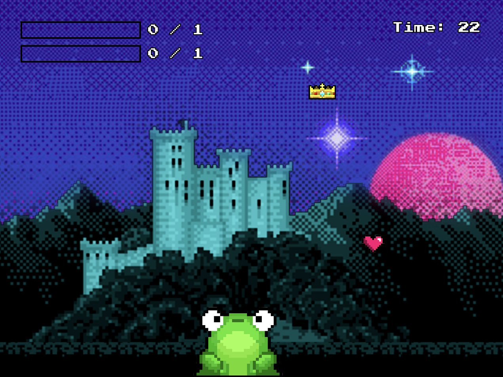

# FROG OF DESTINY

CAMELIA PITSILIS

[View this project online](https://cameliapitsilis-lgtm.github.io/cart253/variation-jam/)

## Description

Frog of Destiny is a myth-inspired, frog tongue catching game where the player controls a
mystical frog that seeks either wisdom or fortune.

There are 4 modes:

In Ancient Greek mythology, frogs were often associated with prophecy. So in the game Greek Oracle Game, there will be two types of flying prophetical orbs: Golden Truthful Prophecies and Purple False Prophecies. The Frog will have to eat the Golden Truthful Prophecies to gain as many Wisdom Points before the time ends. If the Frog eats the Purple False Prophecies, the frog dies.

In Chinese Mythology, Chan Chu (蟾蜍) is the Three-Legged Mythical Frog that brings fortune.
So in the Chinese Fortune Game, the frog will have to catch as many Golden Coins as possible before the time runs out. However, if the frog catches the Golden Coins too quickly, he will lose Fortune Points because of greed.

In Ancient Egyptian mythology, frogs symbolized rebirth and renewal through the goddess Heqet, who breathes life into the newly born. In the Egyptian Rebirth Game, the frog must catch glowing Nile Blessings, which represent the life-giving floodwaters that sustained Egypt. Each blessing strengthens the frog’s Vitality Score. But the frog must avoid the sacred Rebirth Sigils, mystical ankh symbols of resurrection. If the frog touches a Rebirth Sigil, it is instantly pulled back into the eternal cycle of life and reborn, forcing the game to restart.

In classic Western fairytales, frogs are often enchanted beings cursed in frog form waiting to be released by true love's kiss. In the Western Fairy Tale Game, the player decides their destiny: either catch True Love’s Kiss to gain Love Points and follow the path of romance and virtue, or catch Crowns of Power to gain Power Points and pursue wealth and dominion over the land. The frog must focus carefully, because catching the wrong symbols or mixing them up slows progress and can prevent the player from reaching their goal before time runs out. Each choice shapes the outcome of the story, revealing a
different ending based on the frog’s priorities.

 Instructions:
 - Move the frog with your mouse
 - Click to launch the tongue
 - Catch object

CHANGES MADE TO THE MOD JAM CODE:
 - Added additional game states: choose your destiny, rebirth, fairytale, different ends.
 - Changed the title screen to have only 2 clickable buttoms for better user interface: choose your... and instructions.
 - Added a menu system: Choose your destiny before gameplay
 - Added an extra instructions page with clickable next and previous arrows.
 - Added multiple game endings based on performance and choices with custom messaging for each.
 - Added two new game modes:
    - Rebirth Mode: Catch nile blessings to increase your vitality points and make sure to avoid rebirth sigil to avoid resurrecting and restart the game.
    - Fairy Tale Mode: Chose your destiny by catching either True Love's Kiss to gain love points or Crown of Power to gain power points.
 - Added time constraints to all the game modes.
 - Added custom scoring bars with dynamic filling based on points.
 - Added different movement and combined them in certain game modes
 - Improved visuals: new frog image, cohesive background and flyin objects designs.
 

## Screenshot(s)

> 
> 
> 
> 
> 

## Attribution

> - This project uses [p5.js](https://p5js.org).

> - The background of the start screen was made by user3679043 from freepick.com: https://www.freepik.com/premium-vector/
abstract-retro-pixel-art-80s-background-eps-10-vector-graphics_18568568.htm?epik=dj0yJnU9cklDOTBFUEtrbEdmNDZ6Q3lLWHl6XzZVYzRGWVdRdmcmcD0wJm49cTlVOG5fZnZBSVRoVUsyd3ZEcloxZyZ0PUFBQUFBR2tNSEVZ

> - The frog was made by PixelArt from pinterest: couldnt find the link as the frog is no longer posted online.

> - The background of the different modes was taken from pinterest: https://uk.pinterest.com/pin/758152918542245462/ 

> - The acropolis of the greek oracle mode was taken from tumblr: https://24.media.tumblr.com/tumblr_md0g8pEBPX1qbzzgco1_500.png

> - The castle of the chinese fortune mode was taken from vectorstock: https://www.vectorstock.com/royalty-free-vector/pixel-japanese-temple-detailed-isolated-vector-22763654

> - The pyramids of the egyptian rebirth mode was taken from vecteezy: https://www.vecteezy.com/vector-art/13210962-pyramids-in-egypt-desert-8bit-pixel-background

> - The castle of the western fairy tale mode was taken from reddit: https://www.reddit.com/r/PixelArt/comments/o63ysf/my_first_pixel_art_a_castle/

> - The coins in the chinese fortune mode was downloaded from nicepng.com :https://www.nicepng.com/ourpic/u2w7a9e6r5r5i1y3_8-bit-mario-coin-mario-coin-pixel/

> - The golden & purple prophecies from the greek oracle mode was made by the handsomeunicorn from thehandsomeunicorn.itch.io :https://handsomeunicorn.itch.io/fireball-sprite

> - The Rebirth Sigil from the Egyptian Rebirth mode was made by the Dino Pixel from dinopixel.com :https://dinopixel.com/ankh-pixel-art-20029

> - The Nile Blessings from the Egyptian Rebirth mode was made by the Hooded Edge from streangriddb.com :https://www.steamgriddb.com/icon/45822ankh-pixel-art-20029

> - The True Love's Kiss from the Western Fairy Tale mode was found on Pinterest :https://mx.pinterest.com/pin/117938083984075257/

> - The Crown from the Western Fairy Tale mode was made by the Dino Pixel from dinopixel.com :https://dinopixel.com/crown-pixel-art-29971

> - A lot of the code was referrenced or taken from https://p5js.org

> - A lot of the code was taken or inspired by Pippin Barr from https://pippinbarr.com/cart253